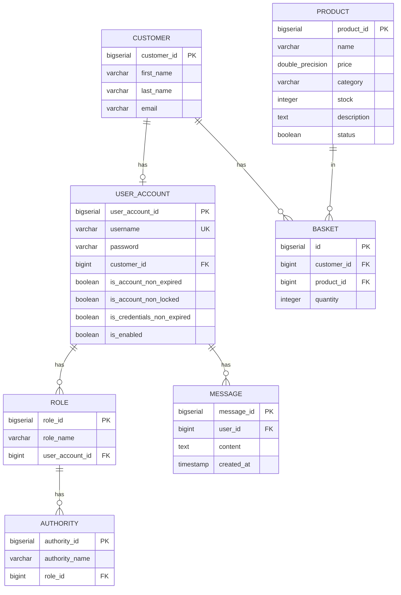

# MarketPlace - Интернет-дүкен платформасы

## Жоба сипаттамасы

MarketPlace - бұл Spring Boot негізінде құрылған заманауи интернет-дүкен платформасы. Жоба RESTful API, PostgreSQL мәліметтер базасы, Spring Security аутентификациясы және Docker контейнерлеу технологияларын қолданады.

## Технологиялық стек

- **Java 21** - бағдарламалау тілі
- **Spring Boot 3.4.0** - негізгі фреймворк
- **Spring Security** - аутентификация және авторизация
- **PostgreSQL 14.6** - реляциялық мәліметтер базасы
- **Flyway** - мәліметтер базасы миграцияларын басқару
- **Docker & Docker Compose** - контейнерлеу
- **MapStruct 1.6.2** - DTO маппинг
- **Lombok 1.18.34** - код генерациясы
- **JUnit 5 & Mockito** - тестілеу

## Жоба құрылымы

```
MarketPlace/
├── src/
│   ├── main/
│   │   ├── java/
│   │   │   └── satbayev/kz/marketplace/
│   │   │       ├── config/          # Конфигурациялар (Security, PasswordEncoder)
│   │   │       ├── controller/      # REST контроллерлер
│   │   │       ├── domain/
│   │   │       │   ├── entity/      # JPA сущностилер
│   │   │       │   └── repository/  # JPA репозиторийлер
│   │   │       ├── dto/             # Data Transfer Objects
│   │   │       ├── mapper/          # MapStruct мапперлер
│   │   │       ├── service/         # Бизнес-логика
│   │   │       └── util/            # Утилиталар (UserAccountDetails)
│   │   └── resources/
│   │       ├── db/migration/        # Flyway миграциялар
│   │       └── application.yaml     # Конфигурация
│   └── test/                        # Тесттер
├── docker-compose.yaml              # Docker Compose конфигурациясы
├── Dockerfile                       # Backend контейнер конфигурациясы
└── pom.xml                          # Maven dependencies
```

## Мәліметтер базасы схемасы

### Негізгі сущностилер:

1. **Customer** - тұтынушы ақпараты (firstName, lastName, email)
2. **UserAccount** - пайдаланушы аккаунты (username, password, ролдер, статустар)
3. **Role** - ролдер (roleName: ADMIN, USER)
4. **Authority** - рұқсаттар (authorityName: ROLE_ADMIN, ROLE_USER)
5. **Product** - өнімдер (name, price, category, stock, description, status)
6. **Basket** - себет (customer, product, quantity)
7. **Message** - хабарламалар (user, content, createdAt)

### ER-диаграмма



### Байланыстар:

- `Customer` **1:1** `UserAccount` (customer_id)
- `UserAccount` **1:N** `Role` (user_account_id)
- `Role` **1:N** `Authority` (role_id)
- `Customer` **1:N** `Basket` (customer_id)
- `Product` **1:N** `Basket` (product_id)
- `UserAccount` **1:N** `Message` (user_id)
- `Basket` - UNIQUE constraint на (customer_id, product_id)

## Алғышарттар

Жобаны іске қосу үшін қажетті:

- **Java 21** (немесе жоғары)
- **Maven 3.6+**
- **Docker** және **Docker Compose**
- **PostgreSQL 14+** (немесе Docker арқылы)

## Орнату және іске қосу

### 1-әдіс: Docker Compose арқылы (Ұсынылады)

```bash
# Жобаны клонировать ету
git clone <repository-url>
cd MarketPlace

# Maven арқылы жобаны құрастыру
mvn clean package -DskipTests

# Docker Compose арқылы іске қосу
docker-compose up -d

# Логтарды көру
docker-compose logs -f backend
```

Жоба мына адресте іске қосылады: `http://localhost:8081`

### 2-әдіс: Локальды іске қосу

```bash
# PostgreSQL мәліметтер базасын іске қосу (Docker арқылы)
docker-compose up -d postgres

# Жобаны құрастыру
mvn clean package

# Жобаны іске қосу
java -jar target/MarketPlace-0.0.1-SNAPSHOT.jar
```

### Конфигурация

`application.yaml` файлында мәліметтер базасы параметрлерін өзгертуге болады:

```yaml
spring:
  datasource:
    url: jdbc:postgresql://localhost:5432/postgres
    username: postgres
    password: postgres
  jpa:
    hibernate:
      ddl-auto: validate
  flyway:
    enabled: true
    locations: classpath:db/migration

server:
  port: 8081
```

## API Эндпоинттер

### Аутентификация API (`/api/auth`)

| Метод | Эндпоинт | Сипаттама | Аутентификация |
|-------|----------|-----------|----------------|
| POST | `/api/auth/login` | Жүйеге кіру | Не қажет |

### Продукттер API (`/api/products`)

| Метод | Эндпоинт | Сипаттама | Аутентификация |
|-------|----------|-----------|----------------|
| GET | `/api/products` | Барлық өнімдерді алу (keyword параметрімен фильтрлеу) | Не қажет |
| GET | `/api/products/{id}` | Өнімді ID бойынша алу | Не қажет |
| POST | `/api/products` | Жаңа өнім қосу | Қажет |
| PUT | `/api/products/{id}` | Өнімді жаңарту | Қажет |
| DELETE | `/api/products/{id}` | Өнімді жою | Қажет |

### Пайдаланушылар API (`/api/users`)

| Метод | Эндпоинт | Сипаттама | Аутентификация |
|-------|----------|-----------|----------------|
| GET | `/api/users` | Барлық пайдаланушыларды алу | Қажет |
| GET | `/api/users/{id}` | Пайдаланушыны ID бойынша алу | Қажет |
| POST | `/api/users` | Жаңа пайдаланушы қосу | Қажет |
| PUT | `/api/users/{id}` | Пайдаланушыны жаңарту | Қажет |
| DELETE | `/api/users/{id}` | Пайдаланушыны жою | Қажет |
| PATCH | `/api/users/{id}/password` | Парольді өзгерту | Қажет |
| PATCH | `/api/users/{id}/role-admin` | Рөлді админге өзгерту | Қажет (ADMIN) |

### Тұтынушылар API (`/api/customers`)

| Метод | Эндпоинт | Сипаттама | Аутентификация |
|-------|----------|-----------|----------------|
| POST | `/api/customers/register` | Тұтынушыны тіркеу (Customer + UserAccount құру) | Не қажет |

### Себет API (`/api/basket`)

| Метод | Эндпоинт | Сипаттама | Аутентификация |
|-------|----------|-----------|----------------|
| GET | `/api/basket/{customerId}` | Тұтынушының себетін алу (totalPrice есептеумен) | Қажет |
| POST | `/api/basket/add?customerId={id}&productId={id}&quantity={qty}` | Себетке өнім қосу | Қажет |
| DELETE | `/api/basket/remove?customerId={id}&productId={id}` | Себеттен өнім жою | Қажет |

### Профиль API (`/api/profile`)

| Метод | Эндпоинт | Сипаттама | Аутентификация |
|-------|----------|-----------|----------------|
| GET | `/api/profile/products?keyword={keyword}` | Пайдаланушы үшін өнімдерді алу (фильтрлеумен) | Қажет |
| GET | `/api/profile/user` | Ағымдағы пайдаланушы ақпаратын алу | Қажет |

## API тестілеу мысалдары

### cURL мысалдары

#### 1. Тіркелу
```bash
curl -X POST http://localhost:8081/api/customers/register \
  -H "Content-Type: application/json" \
  -d '{
    "firstName": "Асылбек",
    "lastName": "Қасымов",
    "email": "asylbek@example.com",
    "password": "password123"
  }'
```

#### 2. Кіру
```bash
curl -X POST http://localhost:8081/api/auth/login \
  -H "Content-Type: application/json" \
  -d '{
    "username": "asylbek@example.com",
    "password": "password123"
  }'
```

#### 3. Барлық өнімдерді алу
```bash
curl -X GET http://localhost:8081/api/products
```

#### 4. Өнімдерді фильтрлеу
```bash
curl -X GET "http://localhost:8081/api/products?keyword=телефон"
```

#### 5. Өнімді ID бойынша алу
```bash
curl -X GET http://localhost:8081/api/products/1
```

#### 6. Жаңа өнім қосу (аутентификация қажет)
```bash
curl -X POST http://localhost:8081/api/products \
  -H "Content-Type: application/json" \
  -H "Authorization: Bearer <token>" \
  -d '{
    "name": "iPhone 15 Pro",
    "price": 500000.0,
    "category": "Электроника",
    "stock": 10,
    "description": "Жаңа iPhone модель",
    "status": true
  }'
```

#### 7. Өнімді жаңарту
```bash
curl -X PUT http://localhost:8081/api/products/1 \
  -H "Content-Type: application/json" \
  -H "Authorization: Bearer <token>" \
  -d '{
    "name": "Жаңартылған өнім",
    "price": 550000.0,
    "category": "Электроника",
    "stock": 15,
    "description": "Жаңартылған сипаттама",
    "status": true
  }'
```

#### 8. Өнімді жою
```bash
curl -X DELETE http://localhost:8081/api/products/1 \
  -H "Authorization: Bearer <token>"
```

#### 9. Себетке өнім қосу
```bash
curl -X POST "http://localhost:8081/api/basket/add?customerId=1&productId=1&quantity=2" \
  -H "Authorization: Bearer <token>"
```

#### 10. Тұтынушының себетін алу
```bash
curl -X GET http://localhost:8081/api/basket/1 \
  -H "Authorization: Bearer <token>"
```

#### 11. Себеттен өнім жою
```bash
curl -X DELETE "http://localhost:8081/api/basket/remove?customerId=1&productId=1" \
  -H "Authorization: Bearer <token>"
```

## Тестілеу

### Барлық тесттерді іске қосу

```bash
mvn test
```

### Нақты тест класын іске қосу

```bash
mvn test -Dtest=ProductControllerTest
mvn test -Dtest=BasketControllerTest
mvn test -Dtest=UserControllerTest
```

### Тесттік конфигурация

Тесттер үшін H2 in-memory базасы қолданылады (`application-test.yaml`).

## Flyway миграциялар

Flyway мәліметтер базасы схемасын басқару үшін қолданылады. Барлық миграциялар `src/main/resources/db/migration/` директориясында орналасқан.

### Миграциялар тізімі:

- `V1__create_authority_table.sql` - Role және Authority кестелерін құру
- `V2__create_role_table.sql` - Резерв (бос файл)
- `V3__create_customer_table.sql` - Customer кестесін құру
- `V4__create_user_account_table.sql` - UserAccount кестесін құру және foreign key байланыстары
- `V5__create_product_table.sql` - Product кестесін құру
- `V6__create_basket_table.sql` - Basket кестесін құру (UNIQUE constraint)
- `V7__create_messages_table.sql` - Messages кестесін құру

### Миграцияларды қолмен іске қосу

```bash
mvn flyway:migrate
```

### Миграцияларды бастапқылау

```bash
mvn flyway:baseline
```

## Docker командалары

### Контейнерлерді іске қосу
```bash
docker-compose up -d
```

### Контейнерлерді тоқтату
```bash
docker-compose down
```

### Логтарды көру
```bash
docker-compose logs -f backend
docker-compose logs -f postgres
```

### Контейнерлерді қайта құру
```bash
docker-compose up -d --build
```

### Volume-дарды жою (мәліметтер базасы деректерін жою)
```bash
docker-compose down -v
```

### PostgreSQL контейнеріне қосылу
```bash
docker exec -it marketplace-postgres psql -U postgres -d postgres
```

## Безопасность

Жоба Spring Security қолданады:

- **Аутентификация**: Username/Password
- **Авторизация**: Role-based (ADMIN, USER)
- **Парольдер**: BCrypt хэштелген
- **Session Management**: Stateless (JWT немесе session-based)

### Ролдер:

- **ADMIN** - толық қолжетімділік (өнімдерді басқару, пайдаланушыларды басқару)
- **USER** - шектеулі қолжетімділік (өнімдерді көру, себетті басқару)

### Security конфигурациясы

Security конфигурациясы `SpringSecurityConfig` класында орналасқан. Кейбір эндпоинттер ашық (register, login), ал басқалары аутентификация талап етеді.

## Архитектура

### Design Patterns

- **RESTful API**: REST принциптеріне сәйкес эндпоинттер
- **Dependency Injection**: Spring IoC контейнері
- **DTO Pattern**: Entity мен API арасында DTO қолдану
- **Mapper Pattern**: MapStruct арқылы Entity ↔ DTO маппинг
- **Repository Pattern**: JPA Repository арқылы деректер қатынасы
- **Service Layer Pattern**: Бизнес-логиканы service қабатында орындау

### Каттар (Layers)

1. **Controller Layer** - REST API эндпоинттер
2. **Service Layer** - Бизнес-логика
3. **Repository Layer** - Деректер қатынасы (JPA)
4. **Entity Layer** - Домен модельдері
5. **DTO Layer** - Data Transfer Objects
6. **Mapper Layer** - Entity ↔ DTO түрлендіру

## Логтау

Жоба Spring Boot стандартты логтау механизмін қолданады. Логтар консольге шығарылады.

## Мәселелерді шешу

### Мәліметтер базасына қосылу мәселесі

1. PostgreSQL контейнерінің іске қосылғанын тексеру:
```bash
docker-compose ps
```

2. Мәліметтер базасы параметрлерін тексеру (`application.yaml`)

3. PostgreSQL логтарын тексеру:
```bash
docker-compose logs postgres
```

### Порт бос емес

Егер 8081 порты бос емес болса, `application.yaml` файлында портты өзгертіңіз:
```yaml
server:
  port: 8082  # Басқа порт
```

### Flyway миграция мәселелері

Миграцияларды қолмен бастапқылау:
```bash
mvn flyway:baseline
mvn flyway:migrate
```

### Schema validation мәселелері

Егер Hibernate schema validation қате беретін болса, `application.yaml` файлында:
```yaml
spring:
  jpa:
    hibernate:
      ddl-auto: update  # validate орнына
```

**Ескерту**: Production ортасында `validate` режимін қолдану ұсынылады.
